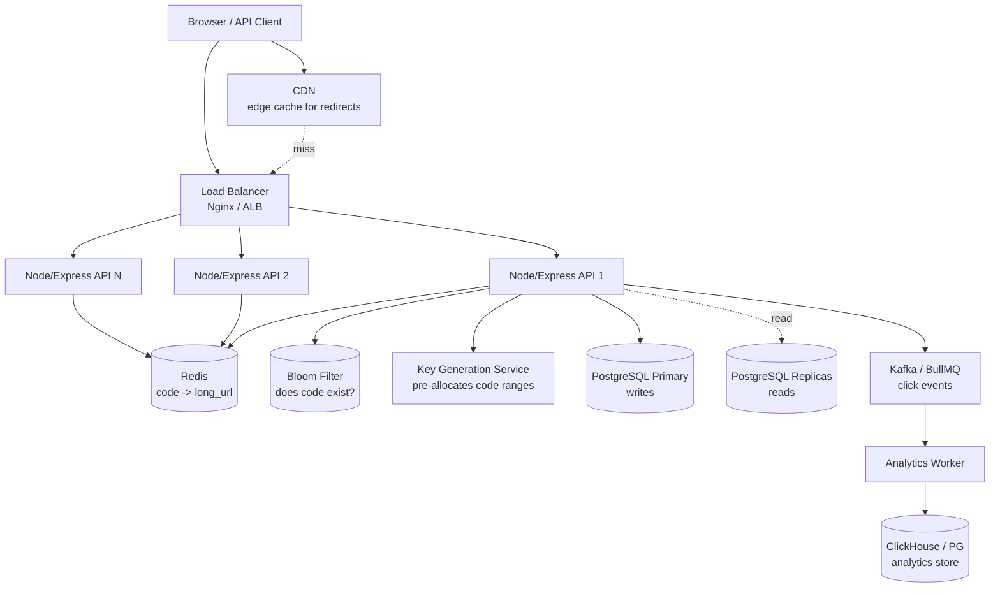
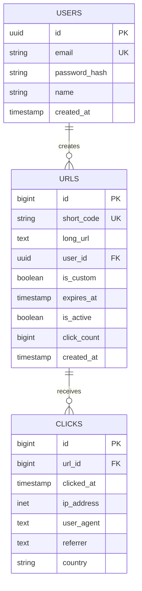
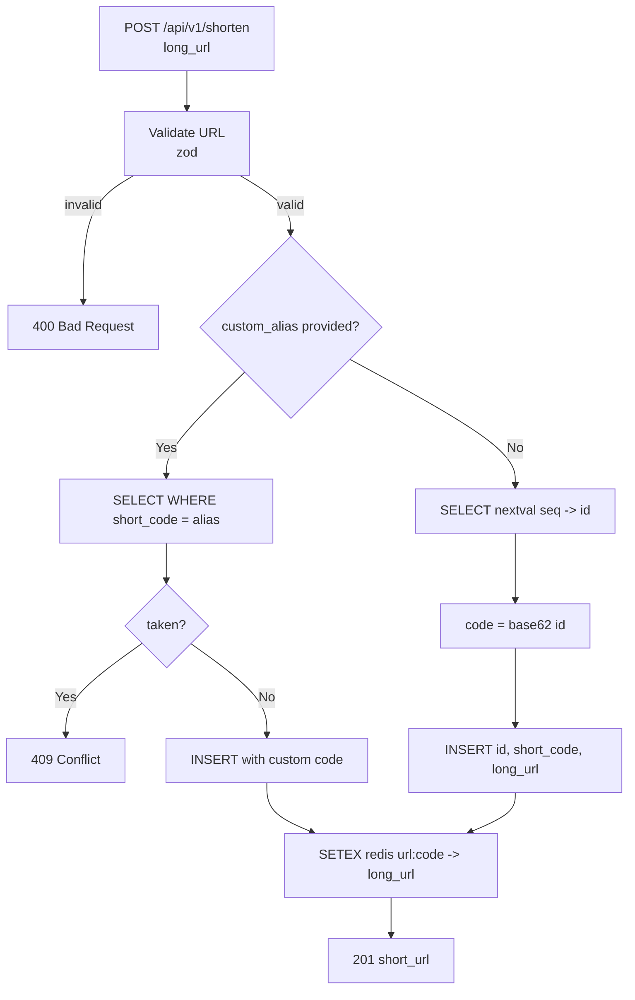
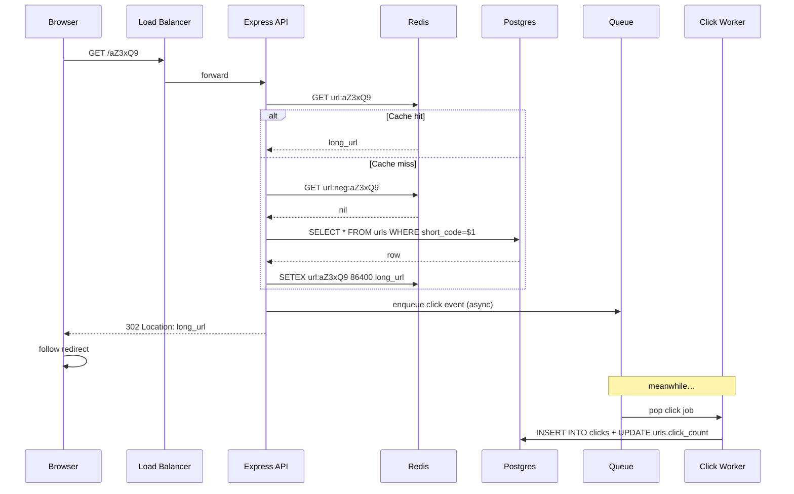
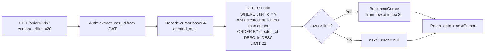
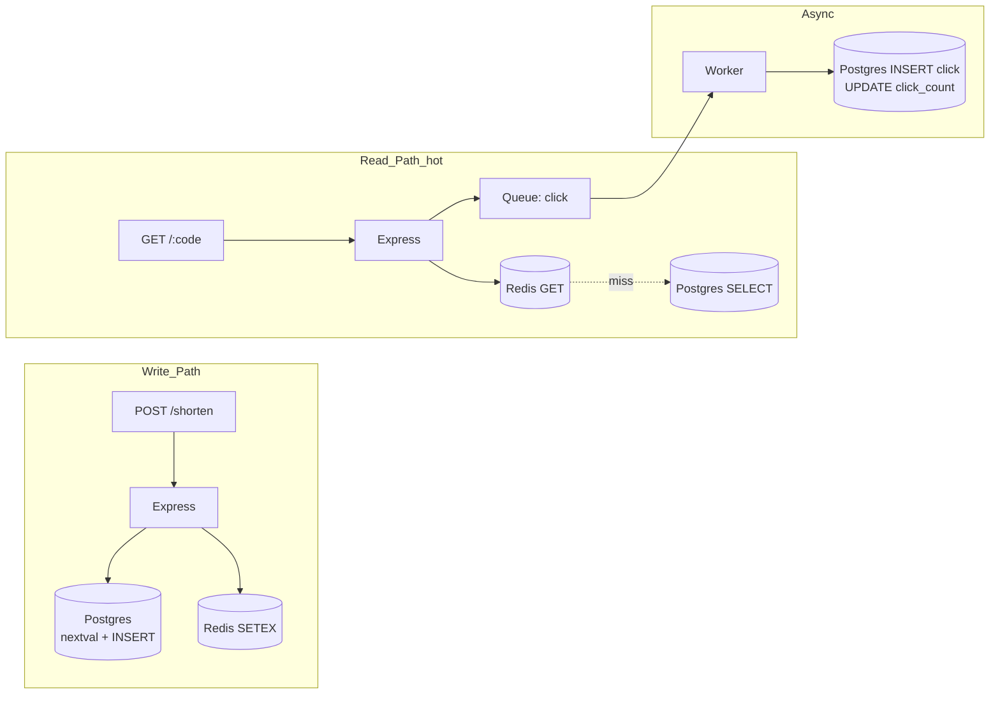

# URL Shortener — HLD & LLD (PERN Backend)

> Interview-ready design doc for a PERN developer.
> Covers system design, short-code generation, database schema, backend API code (insert + redirect + paginated reads), and flow diagrams. **Backend only — no frontend.**

---

## 📑 Table of Contents

1. [Problem Statement & Requirements](#1-problem-statement--requirements)
2. [High Level Design (HLD)](#2-high-level-design-hld)
3. [Short Code Generation Strategies](#3-short-code-generation-strategies)
4. [Low Level Design (LLD)](#4-low-level-design-lld)
5. [Database Schema (PostgreSQL)](#5-database-schema-postgresql)
6. [API Design](#6-api-design)
7. [Code: Shorten URL (Insert)](#7-code-shorten-url-insert)
8. [Code: Redirect (Hot Path)](#8-code-redirect-hot-path)
9. [Code: List URLs with Pagination](#9-code-list-urls-with-pagination)
10. [Flow Diagrams](#10-flow-diagrams)
11. [Common Interview Questions](#11-common-interview-questions)

---

## 1. Problem Statement & Requirements

Build a service like **bit.ly / tinyurl** — take a long URL and return a tiny one (`https://sho.rt/aZ3xQ9`). Hitting the short URL redirects to the original.

### Functional Requirements
- `POST /shorten` → return short code for a given long URL
- `GET /:code` → 302 redirect to the long URL
- Optional **custom alias** (`sho.rt/my-launch`)
- Optional **expiration** (TTL on a link)
- **Analytics** — click counts, referrers, geo, user agent
- User accounts to manage their own links
- **List my URLs** with pagination

### Non-Functional Requirements
- **Highly available** — 99.99% (links must resolve)
- **Low latency** redirect — p99 < 50 ms
- **Read-heavy** — read:write ≈ 100:1 (people click a lot more than they create)
- Short codes must be **unique** and **non-guessable**
- Scalable to **billions** of URLs

### Scale Estimate
| Metric | Number |
|---|---|
| New URLs / day | 100M |
| Reads (clicks) / day | 10B |
| Reads / sec | ~115K |
| Writes / sec | ~1.2K |
| Storage (5 yrs, ~500B/url) | ~100 TB |

→ The system is **read-dominated**. Cache aggressively. The redirect path is the one that *must* be fast.

### Short code length
- Base62 (`a-z A-Z 0-9`) gives **62 symbols**.
- 7 chars → `62^7 ≈ 3.5 trillion` combinations — enough for ~5 years at 100M/day.
- Most production shorteners use 6–8 chars.

---

## 2. High Level Design (HLD)

### 2.1 Architecture



### 2.2 Components

| Component | Responsibility |
|---|---|
| **CDN** | Edge-cache 302s where possible (with short TTL) |
| **Load Balancer** | Distribute, SSL terminate |
| **API servers** | Stateless Node/Express. Two paths: write (`POST /shorten`) and hot read (`GET /:code`) |
| **Redis** | Cache `code → long_url`. The whole point of low-latency redirects |
| **Bloom filter** | Quick "does this code exist?" check before DB lookup — saves DB hits on garbage codes |
| **Key Generation Service (KGS)** | Pre-generates unique codes in batches so writes don't collide |
| **Postgres primary** | Source of truth |
| **Postgres replicas** | Serve reads (analytics dashboards, user lists) |
| **Queue + Worker** | Click events go async — don't slow the redirect |
| **Analytics store** | ClickHouse or partitioned Postgres for time-series clicks |

### 2.3 Why these choices?
- **Stateless API + Redis** → trivially horizontal-scalable
- **Async analytics** → redirect doesn't wait on logging
- **KGS** → avoids race conditions on code generation at high write QPS
- **Bloom filter** → 99% of bot/fuzzed `GET /xyz` requests hit the bloom and 404 fast, never touching the DB
- **Postgres** is fine — the schema is small and relational, and we mostly do PK lookups

---

## 3. Short Code Generation Strategies

This is **the** classic URL-shortener interview question. Know all four.

### 3.1 Base62 of auto-increment ID ✅ (recommended for v1)

```
id = 125 → base62 → "cb"
id = 1000000 → base62 → "4c92"
```

**Pros:** simple, no collisions ever, can decode code → id for O(1) lookup.
**Cons:** codes are guessable / sequential (you can iterate `aaaaaa`, `aaaaab`, ...). Mitigate by starting `id` at a large offset or XOR-ing with a secret.

### 3.2 Hash the long URL (MD5 / SHA-256, take first 7 chars)

**Pros:** same URL → same code (idempotent shortening).
**Cons:** collisions — must check DB on every write and retry by appending salt or shifting bytes.

### 3.3 Random base62 + collision check

```js
crypto.randomBytes(6) → base62 encode → "x9KpL2"
```

**Pros:** unguessable.
**Cons:** at scale, collision check on every insert is a DB hit (mitigate with bloom filter).

### 3.4 Key Generation Service (KGS) — **production-grade**

A separate service pre-generates 1M unique base62 keys ahead of time and stores them in two tables: `unused_keys` and `used_keys`. API servers grab a batch of, say, 1000 keys at a time and serve writes from memory.

**Pros:** zero collisions at write time, no contention, very fast.
**Cons:** more moving parts; need to handle KGS failover.

### 3.5 What this doc uses
**Approach (1) — base62 of auto-increment id**, but using a Postgres **`BIGSERIAL`** with a starting offset (e.g. `100000000`) so codes are at least 6 chars and not super-guessable.

```js
// utils/base62.js
const ALPHA = 'abcdefghijklmnopqrstuvwxyzABCDEFGHIJKLMNOPQRSTUVWXYZ0123456789';

function encode(n) {
  if (n === 0n) return ALPHA[0];
  let s = '';
  let x = BigInt(n);
  const base = 62n;
  while (x > 0n) {
    s = ALPHA[Number(x % base)] + s;
    x = x / base;
  }
  return s;
}

function decode(s) {
  let n = 0n;
  for (const ch of s) {
    const idx = ALPHA.indexOf(ch);
    if (idx === -1) throw new Error('Invalid char');
    n = n * 62n + BigInt(idx);
  }
  return n;
}

module.exports = { encode, decode };
```

---

## 4. Low Level Design (LLD)

### 4.1 Backend folder structure

```
backend/
├── src/
│   ├── config/         # db, redis, env
│   ├── middlewares/    # auth, rateLimit, error
│   ├── modules/
│   │   ├── auth/
│   │   ├── urls/       # core: shorten, redirect, list
│   │   └── analytics/
│   ├── jobs/           # click event consumer
│   ├── utils/          # base62, validation
│   ├── db/             # migrations, pool
│   └── app.js
└── server.js
```

Pattern: **Route → Controller → Service → Repository**, same as the event system.

### 4.2 ER Diagram



---

## 5. Database Schema (PostgreSQL)

### 5.1 DDL

```sql
CREATE EXTENSION IF NOT EXISTS "pgcrypto";

-- ========== USERS ==========
CREATE TABLE users (
    id            UUID PRIMARY KEY DEFAULT gen_random_uuid(),
    email         VARCHAR(255) UNIQUE NOT NULL,
    password_hash VARCHAR(255) NOT NULL,
    name          VARCHAR(120),
    created_at    TIMESTAMPTZ NOT NULL DEFAULT NOW()
);

-- ========== URLS ==========
-- Start id at 100,000,000 so the smallest base62 code is 6 chars
CREATE SEQUENCE urls_id_seq START 100000000;

CREATE TABLE urls (
    id           BIGINT PRIMARY KEY DEFAULT nextval('urls_id_seq'),
    short_code   VARCHAR(10) UNIQUE NOT NULL,
    long_url     TEXT        NOT NULL,
    user_id      UUID        REFERENCES users(id) ON DELETE SET NULL,
    is_custom    BOOLEAN     NOT NULL DEFAULT FALSE,
    is_active    BOOLEAN     NOT NULL DEFAULT TRUE,
    click_count  BIGINT      NOT NULL DEFAULT 0,
    expires_at   TIMESTAMPTZ,
    created_at   TIMESTAMPTZ NOT NULL DEFAULT NOW()
);

ALTER SEQUENCE urls_id_seq OWNED BY urls.id;

-- Indexes
CREATE UNIQUE INDEX idx_urls_short_code ON urls(short_code);
CREATE INDEX idx_urls_user_created ON urls(user_id, created_at DESC);
CREATE INDEX idx_urls_expires ON urls(expires_at) WHERE expires_at IS NOT NULL;

-- ========== CLICKS (analytics) ==========
-- Partitioned by month for easy retention
CREATE TABLE clicks (
    id          BIGSERIAL,
    url_id      BIGINT      NOT NULL REFERENCES urls(id) ON DELETE CASCADE,
    clicked_at  TIMESTAMPTZ NOT NULL DEFAULT NOW(),
    ip_address  INET,
    user_agent  TEXT,
    referrer    TEXT,
    country     CHAR(2),
    PRIMARY KEY (id, clicked_at)
) PARTITION BY RANGE (clicked_at);

-- Example monthly partition
CREATE TABLE clicks_2026_05 PARTITION OF clicks
  FOR VALUES FROM ('2026-05-01') TO ('2026-06-01');

CREATE INDEX idx_clicks_url_time ON clicks(url_id, clicked_at DESC);
```

### 5.2 Why these choices?

| Choice | Reasoning |
|---|---|
| **`BIGINT` PK on urls** | Need to support billions of rows; also we use the id directly to derive the short code |
| **Sequence starts at 100M** | Guarantees codes are at least 6 base62 chars from day 1 |
| **`short_code VARCHAR(10) UNIQUE`** | Index on it is the *one* index that must be fast — every redirect hits it |
| **`UUID` for users** | Don't leak signup growth via sequential IDs |
| **`click_count` denormalized on urls** | Avoids `COUNT(*)` on clicks for every dashboard view; updated async |
| **Partitioned `clicks`** | Time-series, billions of rows — partition by month means dropping old data is `DROP TABLE`, not `DELETE` |
| **Partial index `WHERE expires_at IS NOT NULL`** | Cheaper — most rows have no expiry |
| **`is_active` flag instead of hard delete** | Soft-delete preserves analytics + lets us reactivate |

---

## 6. API Design

| Method | Endpoint | Auth | Purpose |
|---|---|---|---|
| POST | `/api/v1/auth/signup` | — | Create user |
| POST | `/api/v1/auth/login` | — | Login → JWT |
| POST | `/api/v1/shorten` | optional | Create a short URL (anonymous allowed) |
| GET  | `/api/v1/urls` | required | List my URLs (paginated) |
| GET  | `/api/v1/urls/:code/stats` | required | Click analytics for a URL |
| DELETE | `/api/v1/urls/:code` | required | Soft-delete a URL |
| **GET** | **`/:code`** | — | **Redirect (hot path)** |

The redirect lives at the root of the short domain (`sho.rt/abc123`), not under `/api`.

---

## 7. Code: Shorten URL (Insert)

### 7.1 Pool setup

```js
// src/config/db.js
const { Pool } = require('pg');
const pool = new Pool({
  host: process.env.PG_HOST,
  port: process.env.PG_PORT,
  user: process.env.PG_USER,
  password: process.env.PG_PASSWORD,
  database: process.env.PG_DATABASE,
  max: 30,
  idleTimeoutMillis: 30000,
});
module.exports = pool;
```

### 7.2 Validation

```js
// modules/urls/url.schema.js
const { z } = require('zod');

const shortenSchema = z.object({
  long_url:     z.string().url().max(2048),
  custom_alias: z.string().regex(/^[a-zA-Z0-9_-]{4,20}$/).optional(),
  expires_at:   z.string().datetime().optional(),
});

module.exports = { shortenSchema };
```

### 7.3 Repository

```js
// modules/urls/url.repository.js
const pool = require('../../config/db');

async function insertUrl({ short_code, long_url, user_id, is_custom, expires_at }) {
  const sql = `
    INSERT INTO urls (short_code, long_url, user_id, is_custom, expires_at)
    VALUES ($1, $2, $3, $4, $5)
    RETURNING id, short_code, long_url, expires_at, created_at;
  `;
  const { rows } = await pool.query(sql,
    [short_code, long_url, user_id || null, !!is_custom, expires_at || null]);
  return rows[0];
}

// Reserve an id without inserting yet (for base62 strategy)
async function reserveId() {
  const { rows } = await pool.query(`SELECT nextval('urls_id_seq') AS id;`);
  return BigInt(rows[0].id);
}

async function insertWithReservedId({ id, short_code, long_url, user_id, expires_at }) {
  const sql = `
    INSERT INTO urls (id, short_code, long_url, user_id, expires_at)
    VALUES ($1, $2, $3, $4, $5)
    RETURNING id, short_code, long_url, expires_at, created_at;
  `;
  const { rows } = await pool.query(sql,
    [id, short_code, long_url, user_id || null, expires_at || null]);
  return rows[0];
}

async function findByShortCode(code) {
  const { rows } = await pool.query(
    `SELECT short_code, long_url, expires_at, is_active
     FROM urls WHERE short_code = $1`, [code]);
  return rows[0] || null;
}

module.exports = {
  insertUrl, reserveId, insertWithReservedId, findByShortCode,
};
```

### 7.4 Service — two paths: custom alias vs auto-generated

```js
// modules/urls/url.service.js
const repo = require('./url.repository');
const redis = require('../../config/redis');
const { encode } = require('../../utils/base62');

const CACHE_TTL_SEC = 24 * 3600;
const cacheKey = (code) => `url:${code}`;

async function shorten({ long_url, custom_alias, expires_at, user_id }) {
  // Path A — custom alias requested
  if (custom_alias) {
    const existing = await repo.findByShortCode(custom_alias);
    if (existing) {
      const err = new Error('Alias already taken');
      err.status = 409;
      throw err;
    }
    const row = await repo.insertUrl({
      short_code: custom_alias,
      long_url, user_id, is_custom: true, expires_at,
    });
    await redis.setex(cacheKey(row.short_code), CACHE_TTL_SEC, row.long_url);
    return row;
  }

  // Path B — auto-generated via base62(id)
  // Reserve an id, encode it, then insert with that id+code
  const id   = await repo.reserveId();
  const code = encode(id);
  const row  = await repo.insertWithReservedId({
    id: id.toString(), short_code: code, long_url, user_id, expires_at,
  });
  await redis.setex(cacheKey(row.short_code), CACHE_TTL_SEC, row.long_url);
  return row;
}

module.exports = { shorten };
```

> **Why reserve the id first?** Because the short code *is* a function of the id — we can't know the code until we know the id. Reserving via `nextval` guarantees uniqueness with zero collision risk.

### 7.5 Controller + Route

```js
// modules/urls/url.controller.js
const service = require('./url.service');
const { shortenSchema } = require('./url.schema');

async function shorten(req, res, next) {
  try {
    const data = shortenSchema.parse(req.body);
    const url = await service.shorten({
      ...data,
      user_id: req.user?.id,
    });
    res.status(201).json({
      success: true,
      data: {
        short_url:  `${process.env.SHORT_DOMAIN}/${url.short_code}`,
        short_code: url.short_code,
        long_url:   url.long_url,
        expires_at: url.expires_at,
      },
    });
  } catch (err) { next(err); }
}

module.exports = { shorten };
```

```js
// modules/urls/url.routes.js
const router = require('express').Router();
const { authenticateOptional, authenticate } = require('../../middlewares/auth');
const ctrl = require('./url.controller');

router.post('/shorten', authenticateOptional, ctrl.shorten);
router.get('/urls', authenticate, ctrl.list); // see section 9
module.exports = router;
```

---

## 8. Code: Redirect (Hot Path)

This is the critical-path code. It must be **fast**.

```js
// modules/urls/redirect.controller.js
const repo  = require('./url.repository');
const redis = require('../../config/redis');
const queue = require('../../jobs/clickQueue');

const CACHE_TTL_SEC = 24 * 3600;
const NEG_TTL_SEC   = 60;          // cache "not found" briefly to defend DB
const cacheKey = (code) => `url:${code}`;
const negKey   = (code) => `url:neg:${code}`;

async function redirect(req, res, next) {
  const code = req.params.code;

  // Basic shape validation — reject garbage early
  if (!/^[a-zA-Z0-9_-]{4,20}$/.test(code)) {
    return res.status(404).send('Not found');
  }

  try {
    // 1) Positive cache hit — most common path
    const cached = await redis.get(cacheKey(code));
    if (cached) {
      fireAndForgetClick(req, code);
      return res.redirect(302, cached);
    }

    // 2) Negative cache — known bad code, don't hit DB
    if (await redis.get(negKey(code))) {
      return res.status(404).send('Not found');
    }

    // 3) DB lookup
    const row = await repo.findByShortCode(code);
    if (!row || !row.is_active) {
      await redis.setex(negKey(code), NEG_TTL_SEC, '1');
      return res.status(404).send('Not found');
    }
    if (row.expires_at && new Date(row.expires_at) < new Date()) {
      return res.status(410).send('Link expired');
    }

    // 4) Warm cache and redirect
    await redis.setex(cacheKey(code), CACHE_TTL_SEC, row.long_url);
    fireAndForgetClick(req, code);
    return res.redirect(302, row.long_url);
  } catch (err) { next(err); }
}

// Don't await — we don't want to block the redirect on analytics
function fireAndForgetClick(req, code) {
  queue.add('click', {
    code,
    clicked_at: new Date().toISOString(),
    ip:        req.ip,
    user_agent:req.get('user-agent') || null,
    referrer:  req.get('referer') || null,
  }).catch(() => { /* swallow — analytics is best-effort */ });
}

module.exports = { redirect };
```

### 8.1 Wiring at the root of the short domain

```js
// app.js
const express = require('express');
const app = express();
const { redirect } = require('./modules/urls/redirect.controller');

// API routes
app.use('/api/v1', require('./modules/urls/url.routes'));
app.use('/api/v1/auth', require('./modules/auth/auth.routes'));

// Redirect lives at the root: GET /:code
app.get('/:code', redirect);

app.use(require('./middlewares/errorHandler'));
module.exports = app;
```

### 8.2 Click consumer (async)

```js
// jobs/clickConsumer.js
const pool = require('../config/db');
const { Worker } = require('bullmq');
const connection = require('../config/redis');

new Worker('click', async (job) => {
  const { code, clicked_at, ip, user_agent, referrer } = job.data;

  // single SQL: lookup url_id and insert click + bump count
  await pool.query(`
    WITH u AS (
      SELECT id FROM urls WHERE short_code = $1
    ),
    ins AS (
      INSERT INTO clicks (url_id, clicked_at, ip_address, user_agent, referrer)
      SELECT id, $2, $3, $4, $5 FROM u
    )
    UPDATE urls SET click_count = click_count + 1
    WHERE id = (SELECT id FROM u);
  `, [code, clicked_at, ip, user_agent, referrer]);
}, { connection });
```

### 8.3 Why 302 (and not 301)?
- **301 Moved Permanently** → browsers cache the redirect, so the user's next click never even reaches your server. You lose analytics on repeat clicks.
- **302 Found** → browser asks every time. Slightly more load, but click counts are accurate.

Most production shorteners pick **302**.

---

## 9. Code: List URLs with Pagination

User-facing dashboard endpoint — "show me my links". Same two strategies as before.

### 9.1 Offset-based (page numbers)

```js
// modules/urls/url.repository.js
async function listByUserOffset({ user_id, page, limit }) {
  const offset = (page - 1) * limit;

  const dataSql = `
    SELECT short_code, long_url, click_count, expires_at, created_at
    FROM urls
    WHERE user_id = $1 AND is_active = TRUE
    ORDER BY created_at DESC
    LIMIT $2 OFFSET $3;
  `;
  const countSql = `
    SELECT COUNT(*)::int AS total
    FROM urls
    WHERE user_id = $1 AND is_active = TRUE;
  `;

  const [data, count] = await Promise.all([
    pool.query(dataSql, [user_id, limit, offset]),
    pool.query(countSql, [user_id]),
  ]);

  return {
    data: data.rows,
    pagination: {
      page, limit,
      total: count.rows[0].total,
      totalPages: Math.ceil(count.rows[0].total / limit),
    },
  };
}
```

### 9.2 Cursor-based (infinite scroll, fast on deep pages)

```js
async function listByUserCursor({ user_id, limit, cursor }) {
  // cursor = base64("<created_at>|<id>")
  const params = [user_id];
  let where = `user_id = $1 AND is_active = TRUE`;

  if (cursor) {
    const [createdAt, id] = Buffer.from(cursor, 'base64').toString().split('|');
    params.push(createdAt, id);
    // tuple comparison gives stable ordering with ties
    where += ` AND (created_at, id) < ($${params.length - 1}::timestamptz, $${params.length}::bigint)`;
  }

  params.push(limit + 1); // 1 extra to know if more exist
  const sql = `
    SELECT id, short_code, long_url, click_count, created_at
    FROM urls
    WHERE ${where}
    ORDER BY created_at DESC, id DESC
    LIMIT $${params.length};
  `;
  const { rows } = await pool.query(sql, params);

  let nextCursor = null;
  if (rows.length > limit) {
    const last = rows[limit - 1];
    nextCursor = Buffer
      .from(`${last.created_at.toISOString()}|${last.id}`)
      .toString('base64');
    rows.pop();
  }
  return { data: rows, nextCursor };
}
```

### 9.3 Controller

```js
async function list(req, res, next) {
  try {
    const limit  = Math.min(parseInt(req.query.limit) || 20, 100);

    if (req.query.cursor !== undefined) {
      // cursor mode
      const result = await service.listCursor({
        user_id: req.user.id,
        cursor:  req.query.cursor || null,
        limit,
      });
      return res.json({ success: true, ...result });
    }

    // offset mode
    const page = Math.max(parseInt(req.query.page) || 1, 1);
    const result = await service.listOffset({
      user_id: req.user.id, page, limit,
    });
    res.json({ success: true, ...result });
  } catch (err) { next(err); }
}
```

### 9.4 Offset vs Cursor recap

| Use offset when | Use cursor when |
|---|---|
| You need page numbers in UI | Infinite scroll |
| You need total count | Total not needed |
| Small result sets | Millions of rows / deep pagination |
| | Always O(log N) thanks to the index |

---

## 10. Flow Diagrams

### 10.1 Shorten Flow



### 10.2 Redirect Flow (the hot path)



### 10.3 List My URLs (Cursor pagination)



### 10.4 End-to-end architecture path



---

## 11. Common Interview Questions

**Q: Why base62 and not base64?**
Base64 includes `+` and `/` which need URL-encoding, defeating the "short" goal. Base62 (`a-z A-Z 0-9`) is URL-safe.

**Q: How long should the short code be?**
6 chars in base62 = `62^6 ≈ 56 billion` keys. 7 chars = `~3.5 trillion`. At 100M new URLs/day, 6 chars lasts ~1.5 years; 7 chars ~95 years. Most pick 7.

**Q: How do you avoid collisions?**
Approach in this doc: derive code from a sequence — by construction it can't collide. With random/hash strategies: bloom filter pre-check + DB unique constraint + retry on conflict.

**Q: 301 vs 302 redirect?**
301 is browser-cached (fast for the user, but you lose every-click analytics). 302 hits your server every time (slightly more load, but accurate counts and you can change targets later). Most production systems use **302**.

**Q: How do you make redirects fast?**
1. Redis cache `code → long_url` with long TTL (a URL rarely changes)
2. Bloom filter for non-existent codes
3. Negative cache for confirmed-bad codes
4. CDN edge cache where possible
5. Async click logging via queue
6. Read replicas for the rare cache miss

**Q: How do you scale to billions of URLs?**
- Sharding `urls` by `hash(short_code)` across Postgres clusters, OR
- Move to a distributed KV store (Cassandra, DynamoDB) for the hot lookup
- Keep Postgres as the metadata / analytics store
- KGS for code generation removes the single sequence bottleneck

**Q: How do you handle a malicious user submitting 10M URLs?**
- Per-IP and per-user **rate limits** at the edge (`express-rate-limit` + Redis)
- CAPTCHA on anonymous shortens
- Daily quota per user
- Reject URLs against a malware blocklist (Google Safe Browsing API)

**Q: How do you handle expired URLs?**
- Cron / scheduled job runs nightly: `UPDATE urls SET is_active=false WHERE expires_at < NOW() AND is_active=true`
- On read, also check `expires_at < NOW()` and serve `410 Gone` (stops well-behaved bots from retrying)
- Use the partial index `idx_urls_expires` so the scan is cheap

**Q: How do analytics work without slowing redirects?**
Push every click to a queue (Kafka/BullMQ) inside the redirect handler — *never `await`*. A separate worker pool consumes, batches, and writes to ClickHouse / partitioned Postgres. Dashboard reads go to that store, not to the live `clicks` table.

**Q: How do you prevent abuse (spam, phishing redirects)?**
- Domain reputation check at write time
- Async re-scan of stored URLs (a stored URL can become malicious later)
- User-reportable links → review queue → soft-delete

**Q: Why partition the clicks table?**
At 10B reads/day even 0.1% sampling = 10M rows/day. Range partitioning by month means dropping 6-month-old data is `DROP TABLE clicks_2025_11` — instant. Without partitioning, a `DELETE` of that volume would lock the table for hours.

**Q: Could you use Postgres only, no Redis?**
For a small system, yes — Postgres can do 50K reads/sec on PK lookups with a warm buffer cache. But for millions of QPS with p99 < 50ms, Redis is the right tool. It also lets you add bloom filters, rate limits, and queues with the same dependency.

**Q: How would you implement custom domains (vanity URLs like `acme.co/promo`)?**
- Add `domain` column to `urls`, unique on `(domain, short_code)` instead of just `short_code`
- DNS CNAME from customer domain → your edge
- Multi-tenant TLS via ACME (Let's Encrypt)

---

## ✅ Summary Cheat Sheet

```
HLD:    Client → CDN → LB → Stateless Node API → Redis → Postgres (+ replicas)
                                                ↘ Queue → Worker → Analytics store

Codes:  base62(BIGSERIAL with offset 100M)   ← simple, no collisions
        Alternatives: hash+suffix, random+check, KGS for production scale

Schema: users (UUID), urls (BIGINT id, short_code UK, click_count denorm),
        clicks (partitioned by month)

Hot:    Cache → neg-cache → DB → 302 → fire-and-forget click queue

Page:   Offset for dashboards, Cursor for deep / infinite

Wins:   Read-heavy → cache obsessively. Async everything that isn't the redirect.
```

You're ready. Go crush the interview! 🚀
