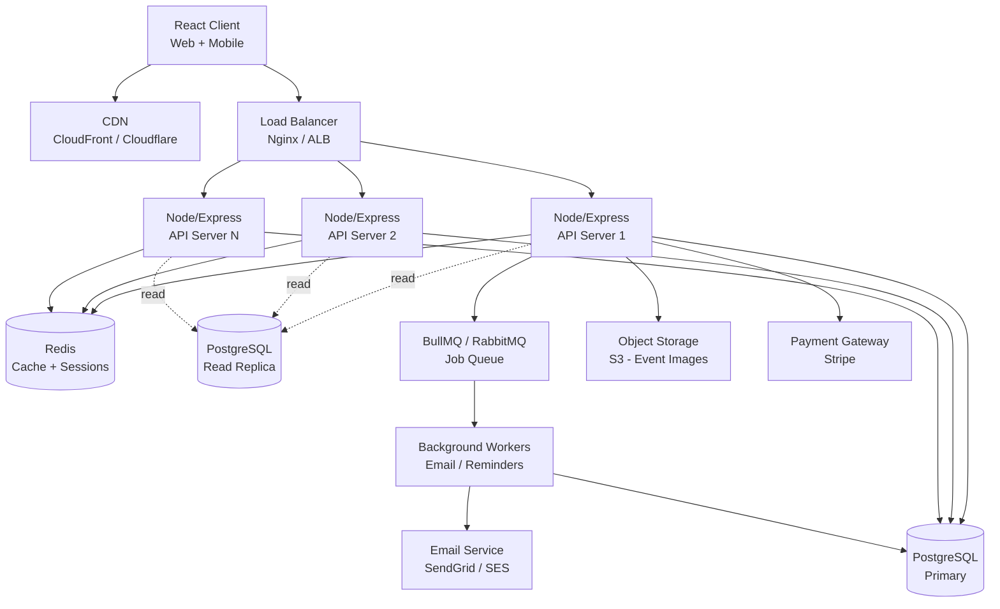
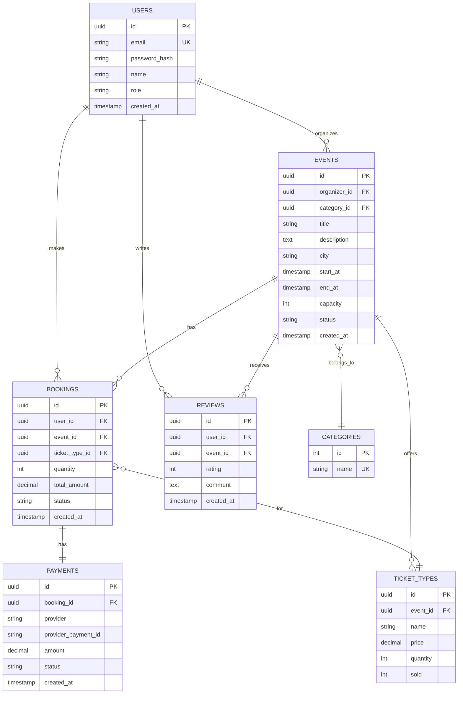
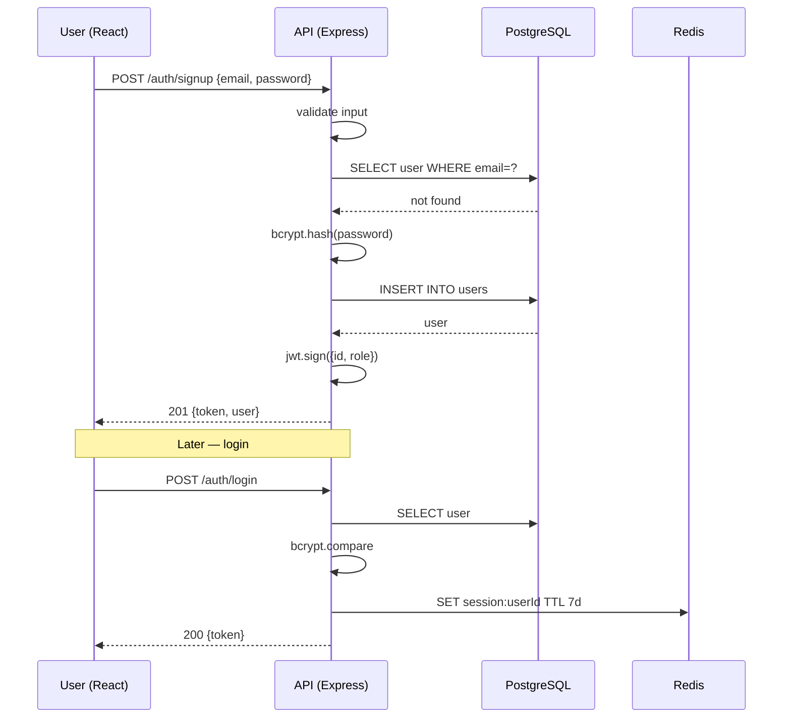
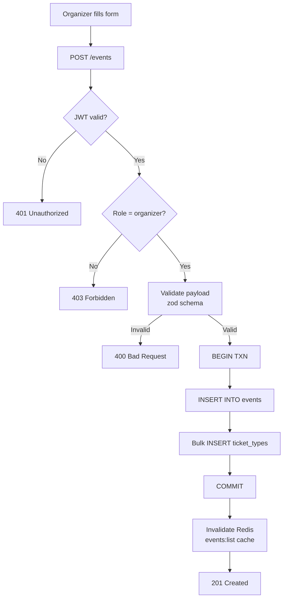
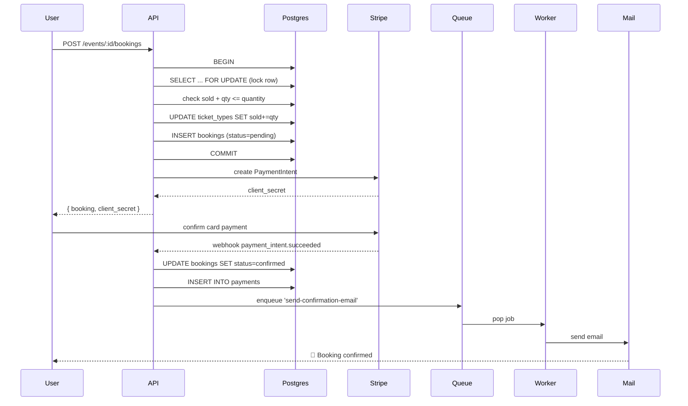
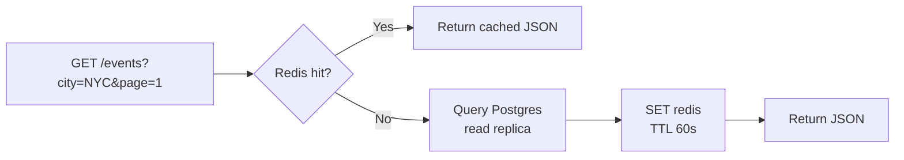

# Event Management System — HLD & LLD (PERN Stack)

> Interview-ready design doc for a PERN (PostgreSQL, Express, React, Node.js) developer.
> Covers system design, database schemas, API code (insert + paginated reads), and flow diagrams.

---

## 📑 Table of Contents

1. [Problem Statement & Requirements](#1-problem-statement--requirements)
2. [High Level Design (HLD)](#2-high-level-design-hld)
3. [Low Level Design (LLD)](#3-low-level-design-lld)
4. [Database Schema (PostgreSQL)](#4-database-schema-postgresql)
5. [API Design](#5-api-design)
6. [Code: Insert Event](#6-code-insert-event)
7. [Code: Get Events with Pagination](#7-code-get-events-with-pagination)
8. [Booking Flow with Transactions](#8-booking-flow-with-transactions)
9. [Flow Diagrams](#9-flow-diagrams)
10. [Common Interview Questions](#10-common-interview-questions)

---

## 1. Problem Statement & Requirements

Build a system where **organizers** can create events and **users** can browse, register, and pay for them (think Eventbrite / Meetup lite).

### Functional Requirements
- User signup / login (JWT-based auth)
- Organizers create / update / cancel events
- Users browse events (filter by category, city, date) with **pagination**
- Users register for an event and book tickets (limited capacity)
- Payment processing (Stripe / Razorpay integration)
- Email notifications (booking confirmation, reminders)
- Reviews & ratings after the event

### Non-Functional Requirements
- **Scalable** — should handle traffic spikes during popular event drops
- **Consistent** — no overbooking (handle race conditions on ticket count)
- **Available** — 99.9% uptime
- **Secure** — auth, RBAC, rate limiting, input validation
- **Low latency** — listing API < 200ms

### Scale Estimate (back-of-envelope)
- 10M users, 100K events, 1M bookings/day
- Read:Write ratio ≈ 100:1 → reads dominate, so **caching** matters

---

## 2. High Level Design (HLD)

### 2.1 Architecture Overview



### 2.2 Key Components

| Component | Responsibility | Tech |
|---|---|---|
| **Client** | UI, state mgmt, routing | React, Redux/Zustand, React Query |
| **CDN** | Static assets, image delivery | CloudFront / Cloudflare |
| **Load Balancer** | Distribute traffic, SSL termination | Nginx / AWS ALB |
| **API Servers** | Business logic, REST endpoints | Node.js + Express |
| **Cache** | Hot data, sessions, rate-limit counters | Redis |
| **Primary DB** | Source of truth, writes | PostgreSQL |
| **Read Replica** | Listing / search queries | PostgreSQL streaming replication |
| **Queue + Workers** | Async jobs (emails, reminders, payouts) | BullMQ on Redis |
| **Object Storage** | Event banners, user avatars | S3 |
| **Payment Gateway** | Capture payments | Stripe |
| **Email Service** | Transactional emails | SendGrid / AWS SES |

### 2.3 Why these choices?
- **PostgreSQL** over NoSQL → relational data (users, events, bookings have strong relations) + ACID for booking
- **Redis** for cache → reduces DB load on hot endpoints like `GET /events`
- **Read replicas** → 100:1 read-write ratio means we offload reads cheaply
- **Queue** → decouple slow side-effects (emails) from request path
- **Stateless API** → horizontal scaling is trivial; sessions live in Redis, not memory

---

## 3. Low Level Design (LLD)

### 3.1 Module / Folder Structure (Backend)

```
backend/
├── src/
│   ├── config/         # db, redis, env, logger
│   ├── middlewares/    # auth, validate, errorHandler, rateLimit
│   ├── modules/
│   │   ├── auth/       # routes, controller, service, schema
│   │   ├── users/
│   │   ├── events/
│   │   ├── bookings/
│   │   ├── payments/
│   │   └── reviews/
│   ├── jobs/           # queue producers + workers
│   ├── utils/          # pagination, errors, jwt
│   ├── db/             # migrations, seeders, pool
│   └── app.js
└── server.js
```

Each module follows: **Route → Controller → Service → Repository**.

- **Route**: HTTP wiring, middleware chain
- **Controller**: parse req, call service, format res
- **Service**: business logic, orchestrates repositories + external services
- **Repository**: raw SQL / ORM queries — only layer touching DB

### 3.2 ER Diagram



---

## 4. Database Schema (PostgreSQL)

### 4.1 DDL

```sql
-- Enable UUID generation
CREATE EXTENSION IF NOT EXISTS "pgcrypto";

-- ========== USERS ==========
CREATE TABLE users (
    id            UUID PRIMARY KEY DEFAULT gen_random_uuid(),
    email         VARCHAR(255) UNIQUE NOT NULL,
    password_hash VARCHAR(255) NOT NULL,
    name          VARCHAR(120) NOT NULL,
    role          VARCHAR(20)  NOT NULL DEFAULT 'user'
                  CHECK (role IN ('user', 'organizer', 'admin')),
    is_active     BOOLEAN      NOT NULL DEFAULT TRUE,
    created_at    TIMESTAMPTZ  NOT NULL DEFAULT NOW(),
    updated_at    TIMESTAMPTZ  NOT NULL DEFAULT NOW()
);

CREATE INDEX idx_users_email ON users(email);

-- ========== CATEGORIES ==========
CREATE TABLE categories (
    id   SERIAL PRIMARY KEY,
    name VARCHAR(60) UNIQUE NOT NULL,
    slug VARCHAR(60) UNIQUE NOT NULL
);

-- ========== EVENTS ==========
CREATE TABLE events (
    id            UUID PRIMARY KEY DEFAULT gen_random_uuid(),
    organizer_id  UUID NOT NULL REFERENCES users(id) ON DELETE CASCADE,
    category_id   INT  NOT NULL REFERENCES categories(id),
    title         VARCHAR(200) NOT NULL,
    description   TEXT,
    banner_url    TEXT,
    venue         VARCHAR(255),
    city          VARCHAR(100) NOT NULL,
    country       VARCHAR(100) NOT NULL,
    start_at      TIMESTAMPTZ  NOT NULL,
    end_at        TIMESTAMPTZ  NOT NULL,
    capacity      INT          NOT NULL CHECK (capacity > 0),
    status        VARCHAR(20)  NOT NULL DEFAULT 'draft'
                  CHECK (status IN ('draft', 'published', 'cancelled', 'completed')),
    created_at    TIMESTAMPTZ  NOT NULL DEFAULT NOW(),
    updated_at    TIMESTAMPTZ  NOT NULL DEFAULT NOW(),
    CHECK (end_at > start_at)
);

-- Indexes for common filters
CREATE INDEX idx_events_status_start    ON events(status, start_at);
CREATE INDEX idx_events_city            ON events(city);
CREATE INDEX idx_events_category        ON events(category_id);
CREATE INDEX idx_events_organizer       ON events(organizer_id);
-- Full-text search on title + description
CREATE INDEX idx_events_search ON events
USING GIN (to_tsvector('english', title || ' ' || COALESCE(description,'')));

-- ========== TICKET TYPES ==========
CREATE TABLE ticket_types (
    id        UUID PRIMARY KEY DEFAULT gen_random_uuid(),
    event_id  UUID NOT NULL REFERENCES events(id) ON DELETE CASCADE,
    name      VARCHAR(60) NOT NULL,         -- e.g. "Early Bird", "VIP"
    price     NUMERIC(10,2) NOT NULL CHECK (price >= 0),
    quantity  INT NOT NULL CHECK (quantity >= 0),
    sold      INT NOT NULL DEFAULT 0 CHECK (sold >= 0),
    UNIQUE (event_id, name),
    CHECK (sold <= quantity)
);

CREATE INDEX idx_ticket_types_event ON ticket_types(event_id);

-- ========== BOOKINGS ==========
CREATE TABLE bookings (
    id              UUID PRIMARY KEY DEFAULT gen_random_uuid(),
    user_id         UUID NOT NULL REFERENCES users(id),
    event_id        UUID NOT NULL REFERENCES events(id),
    ticket_type_id  UUID NOT NULL REFERENCES ticket_types(id),
    quantity        INT  NOT NULL CHECK (quantity > 0),
    total_amount    NUMERIC(10,2) NOT NULL,
    status          VARCHAR(20) NOT NULL DEFAULT 'pending'
                    CHECK (status IN ('pending','confirmed','cancelled','refunded')),
    created_at      TIMESTAMPTZ NOT NULL DEFAULT NOW(),
    updated_at      TIMESTAMPTZ NOT NULL DEFAULT NOW()
);

CREATE INDEX idx_bookings_user  ON bookings(user_id, created_at DESC);
CREATE INDEX idx_bookings_event ON bookings(event_id);

-- ========== PAYMENTS ==========
CREATE TABLE payments (
    id                   UUID PRIMARY KEY DEFAULT gen_random_uuid(),
    booking_id           UUID UNIQUE NOT NULL REFERENCES bookings(id),
    provider             VARCHAR(30) NOT NULL,    -- 'stripe', 'razorpay'
    provider_payment_id  VARCHAR(120),
    amount               NUMERIC(10,2) NOT NULL,
    currency             CHAR(3) NOT NULL DEFAULT 'USD',
    status               VARCHAR(20) NOT NULL DEFAULT 'initiated',
    created_at           TIMESTAMPTZ NOT NULL DEFAULT NOW()
);

-- ========== REVIEWS ==========
CREATE TABLE reviews (
    id         UUID PRIMARY KEY DEFAULT gen_random_uuid(),
    user_id    UUID NOT NULL REFERENCES users(id),
    event_id   UUID NOT NULL REFERENCES events(id),
    rating     INT  NOT NULL CHECK (rating BETWEEN 1 AND 5),
    comment    TEXT,
    created_at TIMESTAMPTZ NOT NULL DEFAULT NOW(),
    UNIQUE (user_id, event_id)
);

CREATE INDEX idx_reviews_event ON reviews(event_id);
```

### 4.2 Why these design choices?

| Choice | Reasoning |
|---|---|
| **UUID PKs** for events/users | Safer to expose in URLs, easier to merge across shards, no leak of growth rate |
| **SERIAL** for categories | Tiny lookup table, integers are smaller / faster |
| **TIMESTAMPTZ** | Always store UTC; client localizes |
| **Status as VARCHAR + CHECK** | Better than ENUM (alter table for new values is painful in PG) |
| **`sold` denormalized on ticket_types** | Avoids `COUNT(*)` on bookings on every read; updated in transaction |
| **GIN index on tsvector** | Cheap full-text search without Elasticsearch for v1 |
| **Composite index `(status, start_at)`** | Most lists are "published events upcoming" — index supports it |

---

## 5. API Design

| Method | Endpoint | Auth | Purpose |
|---|---|---|---|
| POST | `/api/v1/auth/signup` | — | Create user |
| POST | `/api/v1/auth/login`  | — | Issue JWT |
| GET  | `/api/v1/events` | optional | List events (paginated, filters) |
| GET  | `/api/v1/events/:id` | optional | Event details |
| POST | `/api/v1/events` | organizer | Create event |
| PATCH| `/api/v1/events/:id` | organizer | Update event |
| POST | `/api/v1/events/:id/bookings` | user | Book tickets |
| GET  | `/api/v1/users/me/bookings` | user | My bookings |
| POST | `/api/v1/payments/webhook` | stripe-sig | Stripe webhook |

---

## 6. Code: Insert Event

### 6.1 DB Pool (`src/config/db.js`)

```js
const { Pool } = require('pg');

const pool = new Pool({
  host:     process.env.PG_HOST,
  port:     process.env.PG_PORT,
  user:     process.env.PG_USER,
  password: process.env.PG_PASSWORD,
  database: process.env.PG_DATABASE,
  max: 20,                // max connections in pool
  idleTimeoutMillis: 30000,
  connectionTimeoutMillis: 2000,
});

module.exports = pool;
```

### 6.2 Validation schema (using `zod`)

```js
// modules/events/event.schema.js
const { z } = require('zod');

const createEventSchema = z.object({
  title:       z.string().min(3).max(200),
  description: z.string().max(5000).optional(),
  category_id: z.number().int().positive(),
  city:        z.string().min(1).max(100),
  country:     z.string().min(1).max(100),
  venue:       z.string().max(255).optional(),
  start_at:    z.string().datetime(),
  end_at:      z.string().datetime(),
  capacity:    z.number().int().positive(),
  ticket_types: z.array(z.object({
    name:     z.string().min(1).max(60),
    price:    z.number().nonnegative(),
    quantity: z.number().int().positive(),
  })).min(1),
}).refine(d => new Date(d.end_at) > new Date(d.start_at), {
  message: 'end_at must be after start_at',
});

module.exports = { createEventSchema };
```

### 6.3 Repository

```js
// modules/events/event.repository.js
const pool = require('../../config/db');

async function insertEvent(client, payload) {
  const sql = `
    INSERT INTO events
      (organizer_id, category_id, title, description, venue,
       city, country, start_at, end_at, capacity, status)
    VALUES ($1,$2,$3,$4,$5,$6,$7,$8,$9,$10,'draft')
    RETURNING *;
  `;
  const values = [
    payload.organizer_id, payload.category_id, payload.title,
    payload.description, payload.venue, payload.city, payload.country,
    payload.start_at, payload.end_at, payload.capacity,
  ];
  const { rows } = await client.query(sql, values);
  return rows[0];
}

async function insertTicketTypes(client, eventId, ticketTypes) {
  // bulk insert using UNNEST for performance
  const sql = `
    INSERT INTO ticket_types (event_id, name, price, quantity)
    SELECT $1, name, price, quantity
    FROM UNNEST ($2::text[], $3::numeric[], $4::int[])
      AS t(name, price, quantity)
    RETURNING *;
  `;
  const names     = ticketTypes.map(t => t.name);
  const prices    = ticketTypes.map(t => t.price);
  const quantities= ticketTypes.map(t => t.quantity);
  const { rows } = await client.query(sql, [eventId, names, prices, quantities]);
  return rows;
}

module.exports = { insertEvent, insertTicketTypes };
```

### 6.4 Service (transactional)

```js
// modules/events/event.service.js
const pool = require('../../config/db');
const repo = require('./event.repository');

async function createEvent(organizerId, payload) {
  const client = await pool.connect();
  try {
    await client.query('BEGIN');

    const event = await repo.insertEvent(client, {
      ...payload,
      organizer_id: organizerId,
    });

    const tickets = await repo.insertTicketTypes(
      client, event.id, payload.ticket_types
    );

    await client.query('COMMIT');
    return { ...event, ticket_types: tickets };
  } catch (err) {
    await client.query('ROLLBACK');
    throw err;
  } finally {
    client.release();
  }
}

module.exports = { createEvent };
```

### 6.5 Controller + Route

```js
// modules/events/event.controller.js
const service = require('./event.service');
const { createEventSchema } = require('./event.schema');

async function create(req, res, next) {
  try {
    const data = createEventSchema.parse(req.body);
    const event = await service.createEvent(req.user.id, data);
    res.status(201).json({ success: true, data: event });
  } catch (err) {
    next(err);
  }
}

module.exports = { create };
```

```js
// modules/events/event.routes.js
const router = require('express').Router();
const { authenticate, authorize } = require('../../middlewares/auth');
const ctrl = require('./event.controller');

router.post('/', authenticate, authorize('organizer','admin'), ctrl.create);
router.get('/',  ctrl.list);     // see next section
router.get('/:id', ctrl.getOne);

module.exports = router;
```

---

## 7. Code: Get Events with Pagination

Two approaches — know both for interviews.

### 7.1 Offset-based (simple, but slow on deep pages)

```js
// modules/events/event.repository.js
async function listEventsOffset({ page, limit, city, categoryId, search }) {
  const offset = (page - 1) * limit;
  const params = [];
  const where = [`status = 'published'`, `start_at > NOW()`];

  if (city)       { params.push(city);       where.push(`city = $${params.length}`); }
  if (categoryId) { params.push(categoryId); where.push(`category_id = $${params.length}`); }
  if (search) {
    params.push(search);
    where.push(`to_tsvector('english', title || ' ' || COALESCE(description,''))
                @@ plainto_tsquery('english', $${params.length})`);
  }

  const whereSql = `WHERE ${where.join(' AND ')}`;

  // Run data + count in parallel
  params.push(limit, offset);
  const dataSql = `
    SELECT id, title, city, start_at, capacity, banner_url
    FROM events
    ${whereSql}
    ORDER BY start_at ASC
    LIMIT $${params.length - 1} OFFSET $${params.length};
  `;
  const countSql = `SELECT COUNT(*)::int AS total FROM events ${whereSql};`;

  const [dataRes, countRes] = await Promise.all([
    pool.query(dataSql, params),
    pool.query(countSql, params.slice(0, params.length - 2)),
  ]);

  return {
    data: dataRes.rows,
    pagination: {
      page, limit,
      total: countRes.rows[0].total,
      totalPages: Math.ceil(countRes.rows[0].total / limit),
    },
  };
}
```

### 7.2 Cursor-based (efficient on infinite scroll)

```js
async function listEventsCursor({ limit, cursor, city }) {
  // cursor = base64 of "<start_at>|<id>"
  const params = [];
  const where = [`status = 'published'`, `start_at > NOW()`];

  if (city) { params.push(city); where.push(`city = $${params.length}`); }

  if (cursor) {
    const [startAt, id] = Buffer.from(cursor, 'base64').toString().split('|');
    params.push(startAt, id);
    // tuple comparison guarantees stable ordering
    where.push(`(start_at, id) > ($${params.length - 1}::timestamptz, $${params.length}::uuid)`);
  }

  params.push(limit + 1); // fetch one extra to know if there's a next page
  const sql = `
    SELECT id, title, city, start_at, capacity, banner_url
    FROM events
    WHERE ${where.join(' AND ')}
    ORDER BY start_at ASC, id ASC
    LIMIT $${params.length};
  `;
  const { rows } = await pool.query(sql, params);

  let nextCursor = null;
  if (rows.length > limit) {
    const last = rows[limit - 1];
    nextCursor = Buffer
      .from(`${last.start_at.toISOString()}|${last.id}`)
      .toString('base64');
    rows.pop();
  }
  return { data: rows, nextCursor };
}
```

### 7.3 Controller

```js
async function list(req, res, next) {
  try {
    const page  = Math.max(parseInt(req.query.page)  || 1, 1);
    const limit = Math.min(parseInt(req.query.limit) || 20, 100);
    const result = await service.listEvents({
      page, limit,
      city:       req.query.city,
      categoryId: req.query.category_id ? +req.query.category_id : undefined,
      search:     req.query.q,
    });
    res.json({ success: true, ...result });
  } catch (err) { next(err); }
}
```

### 7.4 When to use which?

| Offset | Cursor |
|---|---|
| Page numbers in UI (1, 2, 3, …) | Infinite scroll / feeds |
| Total count needed | Total not needed |
| Small datasets, shallow pages | Deep pagination (millions of rows) |
| Slow on `OFFSET 100000` | Always O(log N) with index |

### 7.5 Bonus — cache hot listings in Redis

```js
const KEY = (city, page) => `events:list:${city || 'all'}:${page}`;

async function listCached(args) {
  const key = KEY(args.city, args.page);
  const cached = await redis.get(key);
  if (cached) return JSON.parse(cached);

  const fresh = await listEventsOffset(args);
  await redis.setex(key, 60, JSON.stringify(fresh)); // 60s TTL
  return fresh;
}
```

---

## 8. Booking Flow with Transactions

The most-asked part in interviews — **how do you prevent overbooking?**

```js
// modules/bookings/booking.service.js
async function createBooking(userId, eventId, ticketTypeId, quantity) {
  const client = await pool.connect();
  try {
    await client.query('BEGIN');

    // 1. Lock the ticket row to prevent concurrent overselling
    const lockSql = `
      SELECT id, price, quantity, sold
      FROM ticket_types
      WHERE id = $1 AND event_id = $2
      FOR UPDATE;
    `;
    const { rows } = await client.query(lockSql, [ticketTypeId, eventId]);
    if (!rows.length) throw new Error('Ticket type not found');

    const t = rows[0];
    if (t.sold + quantity > t.quantity) {
      throw new Error('Not enough tickets available');
    }

    // 2. Update sold count
    await client.query(
      `UPDATE ticket_types SET sold = sold + $1 WHERE id = $2`,
      [quantity, ticketTypeId]
    );

    // 3. Insert booking (status pending until payment confirms)
    const total = Number(t.price) * quantity;
    const bookingSql = `
      INSERT INTO bookings
        (user_id, event_id, ticket_type_id, quantity, total_amount, status)
      VALUES ($1,$2,$3,$4,$5,'pending')
      RETURNING *;
    `;
    const booking = (await client.query(bookingSql,
      [userId, eventId, ticketTypeId, quantity, total])).rows[0];

    await client.query('COMMIT');
    return booking;
  } catch (err) {
    await client.query('ROLLBACK');
    throw err;
  } finally {
    client.release();
  }
}
```

`SELECT … FOR UPDATE` is the magic — it row-locks `ticket_types` so two concurrent buyers can't both read `sold=99` and each insert a booking that pushes it to 101.

---

## 9. Flow Diagrams

### 9.1 User Signup & Login



### 9.2 Event Creation



### 9.3 Booking + Payment



### 9.4 Read Path with Cache



---

## 10. Common Interview Questions

**Q: Why PostgreSQL over MongoDB for this?**
Strong relations (user → bookings → events → tickets), ACID needed for booking, and we want JOINs + transactions out of the box. JSON columns in PG cover the few document-y needs.

**Q: How do you prevent two users from buying the last ticket?**
Row-level lock with `SELECT … FOR UPDATE` inside a transaction (pessimistic). Alternative: optimistic lock with a version column + retry. For very high contention, Redis-based atomic decrement of a counter, then async DB sync.

**Q: How do you scale reads?**
Read replicas + Redis cache in front of hot endpoints + CDN for static + cursor pagination so deep pages don't kill the DB.

**Q: How do you handle a flash sale (10K users, 1K tickets)?**
1. Pre-warm Redis with the inventory counter
2. `DECR` in Redis (atomic) — reject when below zero
3. Async-write the booking to Postgres via queue
4. Use a queue (e.g. Bull) to throttle DB writes
5. Rate-limit per user/IP at the edge

**Q: Index strategy?**
- B-tree on FK columns and high-selectivity filters (`status`, `start_at`, `city`)
- Composite `(status, start_at)` because queries always combine them
- GIN on tsvector for search
- Don't over-index — every write pays

**Q: How do you implement search?**
v1: Postgres `tsvector` + GIN. v2: ship to Elasticsearch / Meilisearch when fuzzy / typo / facet needs grow.

**Q: How would you shard if needed?**
Shard `events` and `bookings` by `event_id` hash. Keep `users` separate. Cross-shard queries go through a search index, not the DB.

**Q: How are you handling timezones?**
Always `TIMESTAMPTZ` (stored as UTC). The client renders in the user's local zone. Store the event's IANA zone name (`America/New_York`) on the event row for display rules like "starts at 6pm local".

**Q: JWT vs session?**
JWT for stateless API (easy to scale horizontally). Refresh tokens stored in Redis with rotation, short-lived access tokens (15m). Logout = blacklist the refresh token.

**Q: How do you roll out a schema change safely?**
Backward-compatible migrations: add column nullable → deploy code that writes both → backfill → switch reads → drop old. Use `pg_repack` or `CREATE INDEX CONCURRENTLY` to avoid locks.

---

## ✅ Summary Cheat Sheet

```
HLD:   React → CDN/LB → Node API (stateless) → Postgres + Redis + S3 + Queue
LLD:   Route → Controller → Service → Repository
Data:  users, categories, events, ticket_types, bookings, payments, reviews
Pag:   Offset (page numbers) | Cursor (infinite scroll, deep pages)
TXN:   SELECT FOR UPDATE on ticket_types prevents overbooking
Cache: Redis 60s TTL on listings, invalidate on write
Async: Emails / reminders via BullMQ workers
```

Good luck with the interview! 🚀
