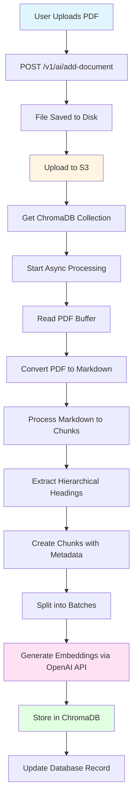
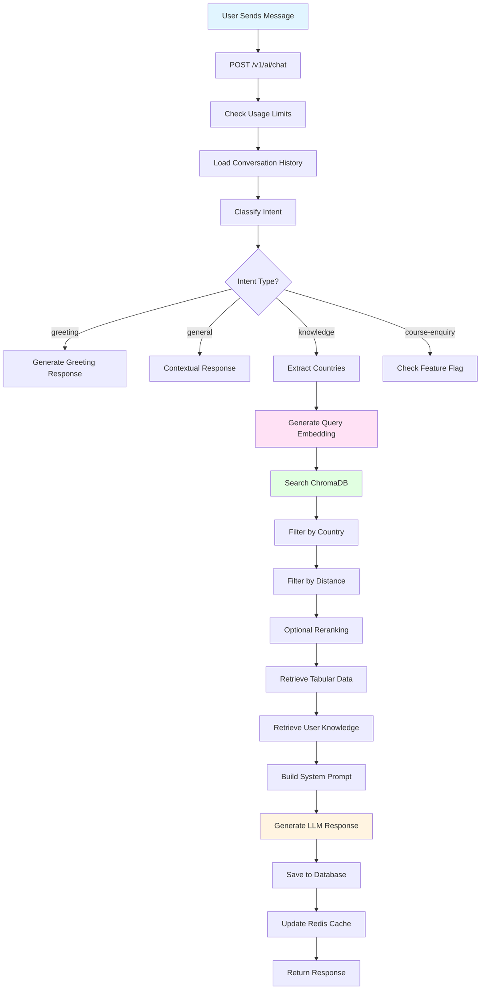
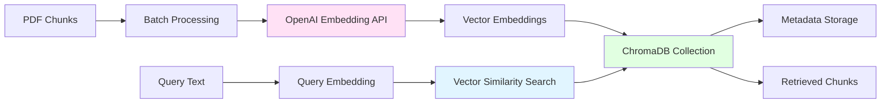
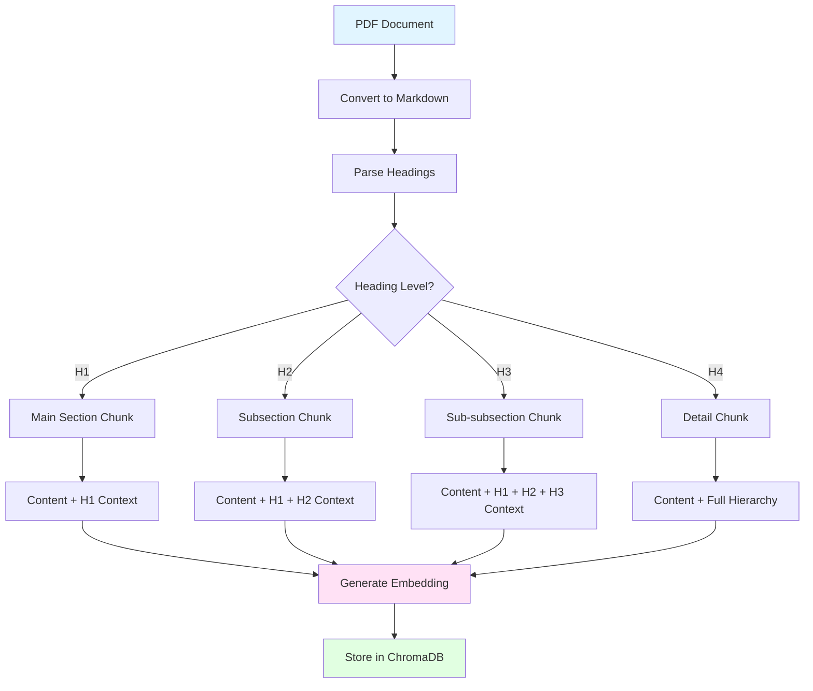

# Chatbot Architecture Documentation

## Overview

This document explains how the AI-powered chatbot system works, including PDF upload, processing using OpenAI LLM, storage in ChromaDB, and retrieval logic.

## Table of Contents

1. [System Architecture](#system-architecture)
2. [PDF Upload Process](#pdf-upload-process)
3. [PDF Processing with OpenAI](#pdf-processing-with-openai)
4. [ChromaDB Storage](#chromadb-storage)
5. [Query Processing & Retrieval](#query-processing--retrieval)
6. [Flow Diagrams](#flow-diagrams)

---

## System Architecture

The chatbot system uses a **Retrieval-Augmented Generation (RAG)** architecture:

- **Document Storage**: PDFs are stored in AWS S3
- **Vector Database**: ChromaDB stores document embeddings
- **LLM**: OpenAI GPT-3.5-turbo or Google Gemini for generating responses
- **Embeddings**: OpenAI `text-embedding-3-large` model for vector embeddings

### Key Components

- **ChromaDB Collections**:
  - `document_embeddings_openAI`: Stores PDF/document embeddings
  - `tabular_data_embedding`: Stores CSV/Excel data embeddings
  - `user_answered_knowledge`: Stores user-answered knowledge base

---

## PDF Upload Process

### 1. API Endpoint

**Route**: `POST /v1/ai/add-document`

**Controller**: `chatbot-controller.js` → `addDocumentToVectorDbAndS3()`

### 2. Upload Flow

```javascript
// From chatbot-controller.js
addDocumentToVectorDbAndS3() {
  return async (req, res) => {
    uploadDisk(req, res, async (err) => {
      // File is uploaded to disk temporarily
      // Then processed and stored
    });
  };
}
```

### 3. Service Layer Processing

**File**: `chatbot-service.js` → `addDocumentToVectorDBAndS3()`

```javascript
exports.addDocumentToVectorDBAndS3 = async (req) => {
  let { country, recordId } = req?.body;
  
  // Step 1: Upload to S3
  const s3Service = new S3Service(Config.aws);
  let fileName = `ChatBotDocuments/${country}/` + req?.file?.originalname;
  let bucket = Config?.aws_buckets?.courseFinderDocumentsBucket;
  const fileBuffer = await fs.promises.readFile(req?.file?.path);
  
  await s3Service.putObjectBuffer(
    bucket,
    fileName,
    fileBuffer,
    { ContentType: req?.file?.mimetype }
  );
  
  // Step 2: Get ChromaDB collection
  const collection = await getOrCreateCollection({ 
    collectionName: EMBEDDING_MODELS.DOCUMENT_DATA_COLLECTION_NAME
  });
  
  // Step 3: Process file asynchronously
  this.processFile(req.file.path, req?.file?.originalname, country, collection)
    .then(async () => {
      // Update database record
      await sequelize.query(`
        UPDATE ChatbotDocuments
        SET IsProcessed = 1
        WHERE Id = ${recordId}
      `);
    });
  
  return 'File processing started!';
};
```

**Key Steps**:
1. File uploaded to temporary disk storage
2. File uploaded to S3 at path: `ChatBotDocuments/{country}/{filename}`
3. File processing started asynchronously (doesn't block response)
4. Database record updated when processing completes

---

## PDF Processing with OpenAI

### 1. PDF to Markdown Conversion

**File**: `common-service.js` → `processPdfToChunks()`

---

## Flow Diagrams

### PDF Upload & Processing Flow



### Query Processing Flow



### ChromaDB Storage Flow



### Document Chunking Structure



---

## Key Configuration

### Environment Variables

```javascript
// OpenAI Configuration
OPENAI_API_KEY=your_api_key_here

// Model Selection
MODEL_TO_USE=openai  // or 'genAI' for Gemini

// Batch Processing Configuration
CHATBOT_BATCH_SIZE=10           // Chunks per batch
CHATBOT_CONCURRENCY=5           // Concurrent batches
CHATBOT_SLEEP_DURATION=1000     // Delay between batches (ms)
CHATBOT_PROGRESS_INTERVAL=10000 // Progress logging interval (ms)

// ChromaDB Configuration
CHROMA_DB_CONNECTION_URL=http://localhost:8000
```

### Collection Names

```javascript
EMBEDDING_MODELS = {
  DOCUMENT_DATA_COLLECTION_NAME: 'document_embeddings_openAI',
  TABULAR_DATA_COLLECTION_NAME: 'tabular_data_embedding',
  USER_ANSWERED_KNOWLEDGE_COLLECTION_NAME: 'user_answered_knowledge'
}
```

---

## Code Snippets Reference

### 1. Complete PDF Processing Flow

```javascript
// chatbot-service.js - addDocumentToVectorDBAndS3()
exports.addDocumentToVectorDBAndS3 = async (req) => {
  // 1. Upload to S3
  const s3Service = new S3Service(Config.aws);
  let fileName = `ChatBotDocuments/${country}/` + req?.file?.originalname;
  await s3Service.putObjectBuffer(bucket, fileName, fileBuffer);
  
  // 2. Get ChromaDB collection
  const collection = await getOrCreateCollection({ 
    collectionName: EMBEDDING_MODELS.DOCUMENT_DATA_COLLECTION_NAME
  });
  
  // 3. Process file asynchronously
  this.processFile(req.file.path, filename, country, collection);
};
```

### 2. Embedding Generation

```javascript
// chatbot-common-service.js - generateEmbeddingFromOpenAi()
exports.generateEmbeddingFromOpenAi = async (inputChunks) => {
  const response = await axios.post(
    'https://api.openai.com/v1/embeddings',
    {
      input: inputChunks,
      model: 'text-embedding-3-large'
    },
    {
      headers: {
        'Authorization': `Bearer ${process.env.OPENAI_API_KEY}`,
        'Content-Type': 'application/json'
      }
    }
  );
  return response.data.data.map(d => d.embedding);
};
```

### 3. Vector Search

```javascript
// chatbot-common-service.js - searchRelevantText()
exports.searchRelevantText = async (query, options, countries, collectionName) => {
  // Generate query embedding
  let queryEmbedding = await generateEmbeddingFromOpenAi(query);
  
  // Build query
  const queryParams = {
    queryEmbeddings: [queryEmbedding],
    nResults: initialFetchCount,
    where: countries ? { country: { $in: countries } } : undefined
  };
  
  // Query ChromaDB
  const results = await collection.query(queryParams);
  
  // Filter and return
  return filterResultsByDistance(results, options);
};
```

---

## Summary

The chatbot system follows a **RAG (Retrieval-Augmented Generation)** architecture:

1. **Upload**: PDFs uploaded to S3 and processed asynchronously
2. **Processing**: PDFs converted to Markdown, chunked hierarchically, and embedded using OpenAI
3. **Storage**: Embeddings stored in ChromaDB with metadata (filename, country, headings)
4. **Retrieval**: User queries embedded and searched in ChromaDB using vector similarity
5. **Generation**: Retrieved context combined with LLM to generate accurate responses

The system handles large documents efficiently through batch processing and maintains document structure through hierarchical chunking.

