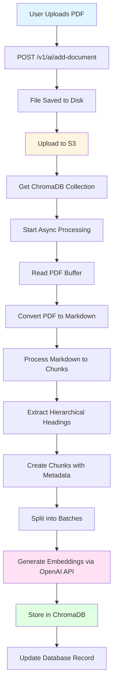
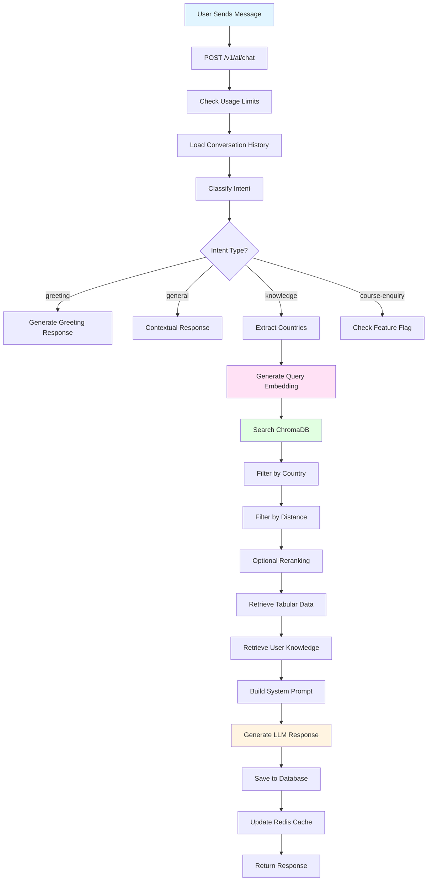
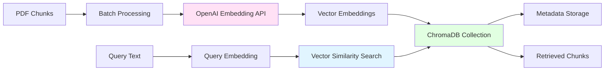
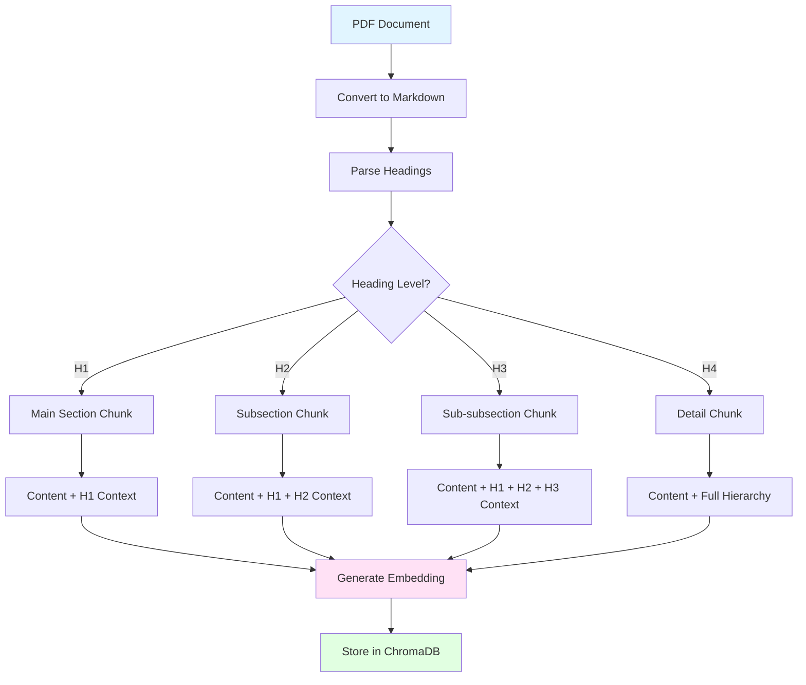

# Chatbot Architecture Documentation

## Overview

This document explains how the AI-powered chatbot system works, including PDF upload, processing using OpenAI LLM, storage in ChromaDB, and retrieval logic.

## Table of Contents

1. [System Architecture](#system-architecture)
2. [PDF Upload Process](#pdf-upload-process)
3. [PDF Processing with OpenAI](#pdf-processing-with-openai)
4. [ChromaDB Storage](#chromadb-storage)
5. [Query Processing & Retrieval](#query-processing--retrieval)
6. [Flow Diagrams](#flow-diagrams)

---

## System Architecture

The chatbot system uses a **Retrieval-Augmented Generation (RAG)** architecture:

- **Document Storage**: PDFs are stored in AWS S3
- **Vector Database**: ChromaDB stores document embeddings
- **LLM**: OpenAI GPT-3.5-turbo or Google Gemini for generating responses
- **Embeddings**: OpenAI `text-embedding-3-large` model for vector embeddings

### Key Components

- **ChromaDB Collections**:
  - `document_embeddings_openAI`: Stores PDF/document embeddings
  - `tabular_data_embedding`: Stores CSV/Excel data embeddings
  - `user_answered_knowledge`: Stores user-answered knowledge base

---

## PDF Upload Process

## Flow Diagrams

### PDF Upload & Processing Flow

### Query Processing Flow

### ChromaDB Storage Flow

### Document Chunking Structure

## Summary

The chatbot system follows a **RAG (Retrieval-Augmented Generation)** architecture:

1. **Upload**: PDFs uploaded to S3 and processed asynchronously
2. **Processing**: PDFs converted to Markdown, chunked hierarchically, and embedded using OpenAI
3. **Storage**: Embeddings stored in ChromaDB with metadata (filename, country, headings)
4. **Retrieval**: User queries embedded and searched in ChromaDB using vector similarity
5. **Generation**: Retrieved context combined with LLM to generate accurate responses

The system handles large documents efficiently through batch processing and maintains document structure through hierarchical chunking.

