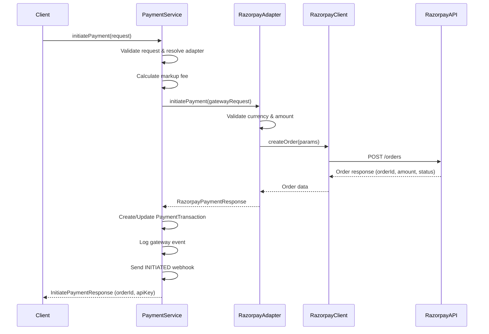
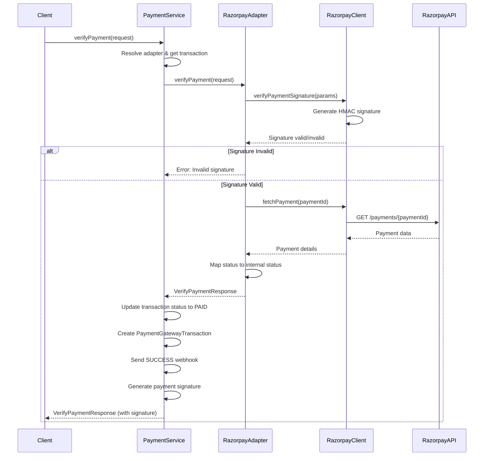
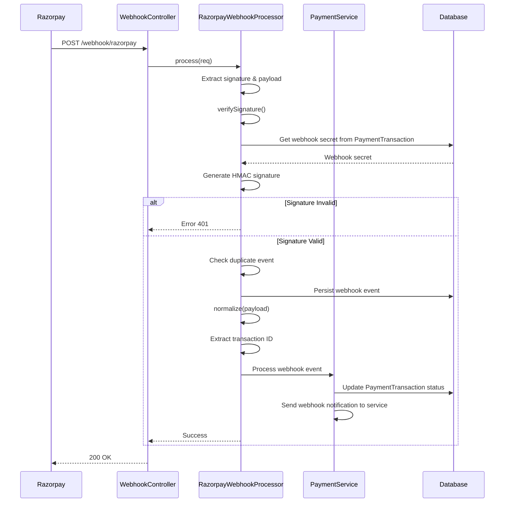

# Razorpay Integration Documentation

## Overview

This document describes the Razorpay payment gateway integration in the payment platform. The integration follows an adapter pattern architecture, allowing seamless payment processing through Razorpay's API.

## Architecture

The Razorpay integration consists of three main components:

1. **RazorpayClient** - Low-level SDK wrapper for Razorpay API calls
2. **RazorpayAdapter** - Business logic adapter that implements gateway interface
3. **RazorpayWebhookProcessor** - Handles incoming webhook events from Razorpay

## Components

### 1. RazorpayClient (`src/modules/payment/gateway/clients/razorpay.client.ts`)

The client is a thin wrapper around the official Razorpay SDK that provides:

- **Initialization**: Creates Razorpay instance with API key and secret
- **Order Management**: Create and fetch orders
- **Payment Operations**: Fetch and capture payments
- **Signature Verification**: Verify payment and webhook signatures
- **Client Caching**: In-memory cache per merchant for performance

#### Key Methods

| Method | Description | Parameters |
|--------|-------------|------------|
| `createOrder()` | Creates a Razorpay order | `amount`, `currency`, `receipt`, `notes` |
| `fetchOrder()` | Fetches order details | `orderId` |
| `fetchPayment()` | Fetches payment details | `paymentId`, `isOrder` |
| `capturePayment()` | Captures authorized payment | `paymentId`, `amount`, `currency` |
| `verifyPaymentSignature()` | Verifies payment signature | `order_id`, `payment_id`, `signature` |
| `verifyWebhookSignature()` | Verifies webhook signature | `payload`, `signature` |

### 2. RazorpayAdapter (`src/modules/payment/gateway/adapters/razorpay.adapter.ts`)

The adapter implements the gateway interface and handles:

- **Payment Initiation**: Creates orders with proper amount conversion (rupees to paise)
- **Payment Verification**: Verifies signatures and fetches payment status
- **Status Mapping**: Maps Razorpay statuses to internal payment statuses
- **Payment Cancellation**: Cancels unpaid orders
- **Webhook Validation**: Validates incoming webhook signatures

#### Key Methods

| Method | Description | Returns |
|--------|-------------|---------|
| `initiatePayment()` | Creates Razorpay order | `RazorpayPaymentResponse` with `orderId` |
| `verifyPayment()` | Verifies payment signature and status | `VerifyPaymentResponse` |
| `getPaymentStatus()` | Fetches current payment status | Status and payment data |
| `cancelPayment()` | Cancels unpaid order | Cancellation result |
| `validateWebhook()` | Validates webhook signature | Boolean |

#### Status Mapping

Razorpay statuses are mapped to internal statuses:

| Razorpay Status | Internal Status |
|----------------|-----------------|
| `captured` | `COMPLETED` |
| `authorized` | `PROCESSING` |
| `created` | `PENDING` |
| `failed` | `FAILED` |
| `refunded` | `REFUNDED` |

### 3. RazorpayWebhookProcessor (`src/modules/payment/webhook/processors/razorpay-webhook-processor.ts`)

Handles incoming webhook events from Razorpay:

- **Signature Verification**: Validates webhook signatures using HMAC SHA256
- **Event Normalization**: Converts Razorpay events to internal format
- **Event Filtering**: Processes only relevant events (`payment.captured`, `payment.failed`)
- **Transaction Resolution**: Maps webhook events to payment transactions

#### Supported Events

| Razorpay Event | Internal Event Type |
|---------------|---------------------|
| `payment.captured` | `PAYMENT_SUCCESS` |
| `payment.failed` | `PAYMENT_FAILED` |
| `payment.authorized` | `PAYMENT_PENDING` |
| `refund.created` | `REFUND_PENDING` |
| `refund.processed` | `REFUND_SUCCESS` |
| `refund.failed` | `REFUND_FAILED` |

## Payment Flow

### 1. Payment Initiation Flow



### 2. Payment Verification Flow



### 3. Webhook Processing Flow



## Implementation Details

### Amount Conversion

Razorpay uses **paise** (smallest currency unit) for amounts, while the platform uses **rupees**:

- **To Razorpay**: Multiply by 100 (₹100 → 10000 paise)
- **From Razorpay**: Divide by 100 (10000 paise → ₹100)

### Signature Verification

#### Payment Signature
```
data = order_id + "|" + payment_id
signature = HMAC-SHA256(data, api_secret)
```

#### Webhook Signature
```
signature = HMAC-SHA256(JSON.stringify(payload), webhook_secret)
```

### Client Caching

Razorpay clients are cached per merchant ID to:
- Avoid recreating SDK instances
- Improve performance
- Maintain configuration consistency

Cache key: `merchantId`
Cache location: In-memory `Map<string, RazorpayClient>`

### Order Creation Parameters

```typescript
{
  amount: number,           // Amount in paise
  currency: string,         // Uppercase currency code (e.g., "INR")
  receipt: string,          // Optional receipt ID
  payment_capture: 1,       // Auto-capture enabled
  notes: {                  // Metadata
    serviceId: string,
    merchantId: string,
    description: string
  }
}
```

### Webhook Event Structure

Razorpay webhook payload structure:
```json
{
  "event": "payment.captured",
  "payload": {
    "payment": {
      "entity": {
        "id": "pay_xxx",
        "order_id": "order_xxx",
        "amount": 10000,
        "currency": "INR",
        "status": "captured",
        "notes": {
          "serviceId": "...",
          "merchantId": "...",
          "paymentTransactionId": "..."
        }
      }
    }
  },
  "created_at": 1234567890
}
```

## Error Handling

### Common Errors

1. **Invalid Signature**: Returns 401 when payment/webhook signature verification fails
2. **Order Not Found**: When fetching non-existent order
3. **Payment Already Captured**: When attempting to cancel a paid order
4. **Webhook Secret Missing**: When webhook secret is not configured

### Error Response Format

```typescript
{
  success: false,
  error: "Error message",
  code: "ERROR_CODE"
}
```

## Configuration

### Required Configuration

```typescript
{
  apiKey: string,           // Razorpay Key ID
  apiSecret: string,        // Razorpay Key Secret
  webhookSecret: string,    // Webhook signing secret (optional)
  merchantId: string        // Internal merchant ID (for caching)
}
```

### Currency Support

Currently supports: **INR** (Indian Rupees)

## Testing

### Test Payment Flow

1. **Initiate Payment**: Create order via `initiatePayment()`
2. **Get Order ID**: Use returned `orderId` for frontend integration
3. **Complete Payment**: Use Razorpay Checkout on frontend
4. **Verify Payment**: Call `verifyPayment()` with payment details
5. **Check Status**: Use `getPaymentStatus()` to check current status

### Webhook Testing

1. Use Razorpay Dashboard to send test webhooks
2. Ensure webhook secret is configured correctly
3. Verify signature validation works
4. Check event normalization and processing

## Security Considerations

1. **API Secrets**: Stored securely in database, never exposed in responses
2. **Signature Verification**: All payments and webhooks are signature-verified
3. **HTTPS Only**: Webhook endpoints should only accept HTTPS requests
4. **Idempotency**: Duplicate webhook events are detected and ignored

## Integration Points

### With Payment Service

- `PaymentService.initiatePayment()` - Uses adapter to create orders
- `PaymentService.verifyPayment()` - Uses adapter to verify payments
- `PaymentService.cancelPayment()` - Uses adapter to cancel orders

### With Webhook System

- `RazorpayWebhookProcessor` extends `AbstractWebhookProcessor`
- Processes events through webhook queue service
- Updates payment transaction status automatically

### With Database

- Creates `PaymentTransaction` records
- Creates `PaymentGatewayTransaction` records
- Stores webhook events in `PaymentGatewayWebhook` table

## Summary

The Razorpay integration provides:

✅ **Order Creation**: Seamless order creation with automatic amount conversion  
✅ **Payment Verification**: Secure signature-based payment verification  
✅ **Webhook Processing**: Automated webhook handling with signature validation  
✅ **Status Mapping**: Automatic mapping of Razorpay statuses to internal statuses  
✅ **Error Handling**: Comprehensive error handling and logging  
✅ **Client Caching**: Performance optimization through client caching  

The architecture follows the adapter pattern, making it easy to add new payment gateways or modify existing ones without affecting the core payment service logic.
